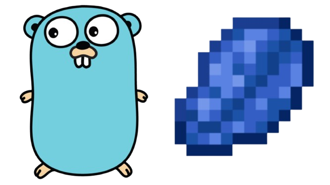

# Lapis Game Engine

> Simple Voxel Game Engine written in Go


---

### Requires

```
github.com/go-gl/gl
github.com/go-gl/glfw/v3.3/glfw
github.com/pelletier/go-toml/v2
```

`Also things you need when you make a OpenGL project.`

---

> [!NOTE]
> **Under development!**
